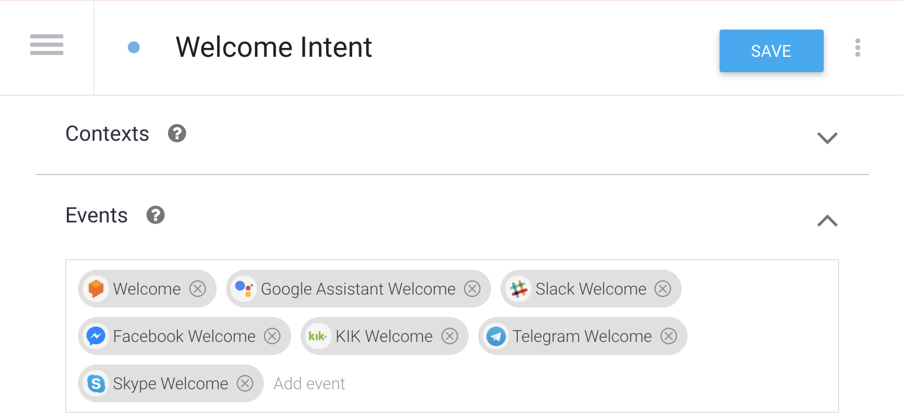

## DialogFlow Glossary

Note: This is an attempt to define DialogFlow concepts in an easy-to-understand manner

If you desire more detail or want from-scratch study materials, check the **[resources document](./resources.md)**

If you want to see some practical examples in action, see the **[examples directory](./../examples/README.md)** for code samples

## TOC

[DialogFlow](#DialogFlow)

[Intent](#Intent)

[Fulfillment](#Fulfillment)

[Context(s)](#Context(s))

[Events](#Events)

[Training Phrases](#Training-Phrases)

[Actions](#Actions)

[Entities](#Entities)

[Slot-Filling](#Slot-Filling)

[Knowledge Connectors & KnowledgeBase](#Knowledge-Connectors-KnowledgeBase)

[Best Practices](#Best-Practices)

## DialogFlow

DialogFlow will take input (from a user's text, voice, etc), analyze the input, then "match" or select an intent and pass along any relevant information it extracted out of the sentence

## Intent

An intent is the smallest unit of action in DialogFlow

Two "kinds" of intents in DialogFlow:

* "Static" intents: mostly hard-coded, simple question-response

* "Dynamic" intents: use *["fulfillment"](#Fulfillment)* to do work, retrieve data for rendering rich media cards

DialogFlow decides which intent to match based on training data and which "contexts" are active/set in a conversation

## Fulfillment

Fulfillment is the process whereby DialogFlow sends a request to your webhook (along with any parameters/"contexts") that will gather data or perform some work and return the result back to the user.

Anything in your chat experience that is at all "dynamic" probably requires fulfillment code.

A good example: if you built a **"get weather"** intent that uses fulfillment, whenever that intent is matched DialogFlow would send a request to your webhook and in your webhook code you would call a weather API and send that information back to the user. 

For fulfillment you need:

- An endpoint/URL so your webhook server is accessible from the public internet

- The name of the intent (so when DialogFlow contacts your webhook server it knows where to go)

Note: you can use Google Cloud functions which have a 1st-classs integration into the DialogFlow web console or host your own server

Also note that fulfillment should be quick, there's a maximum 5-second limit:

- https://developers.google.com/assistant/actions/actions-sdk/deploy-fulfillment

- https://cloud.google.com/dialogflow/docs/fulfillment-webhook

## Context(s)

"Context" is responsible for major two things in DialogFlow:

1) Helps DialogFlow determine which intents to trigger

2) Allows you to pass information between individual intents during a conversation

Longer explanation (worth a careful read): https://cloud.google.com/dialogflow/docs/contexts-overview

## Parameters

Parameters are what get sent to fulfillment code.

Parameters are **extracted** from user input text & mapped to "entities."

Context holds/passes parameters from previous intents

## Events

Events are a way to force a particular intent to be matched. If an intent has an event associated with it and that event is "triggered", that intent will be matched

If you look at the "Welcome Intent" that comes by default in DialogFlow, for instance, notice the welcome events from various platforms (ie a chat session starts) that indicate this intent should fire: 

Further reading: https://cloud.google.com/dialogflow/docs/events-overview

## Training Phrases

These are the phrases that help trigger intents wheneveer a user interacts with your chatbot. They're not the only thing DialogFlow thinks about-- input & output contexts matter too-- but training phrases are very important.

The other really important part of training phrases is that they can be "annotated" to help teach DialogFlow how to extract entities (which will be passed on to fulfillment as "parameters.")

See here for annotation of training phrases: https://cloud.google.com/dialogflow/docs/intents-training-phrases#annotation

## Actions

This is a simple string that gets passed to your backend fulfillment code

## Entities

If you're familiar with "types" in programming languages, think of entities as types in a (integer, string, boolean, etc) If that doesn't help, think of entities as "categories" that you define and DialogFlow will spot items in text that belong to that category.

Entities help DialogFlow know determine what to extract from user input text. Once extracted, those valuess are passed onto fulfillment as "parameters."

There's two general types of entities:

* System entities (ie, someone else did the work for you): email address, zip code, phone number, and other items with all many subtle, complex variations-- you get them "for free"

* Custom entities (you determine it): If you had an agent that prepared ice cream, an example entity would be the "flavor" of ice cream

## Slot-Filling

Slotfilling is the process of making sure all the parameters are "full" by requesting data from the user.

Let's say you have an agent that takes orders of ice cream and there are two required pieces of data: (1) flavor & (2) size

If the user asks "I want a mint ice cream", that has flavor but no size.  Slotfilling is the process that DialogFlow uses to follow up with the user to make sure they provide any information that is unclear or missing.

## Knowledge Connectors & KnowledgeBase

(Note this is a beta feature)

Knowledge Connectors are conceptually very simple but very powerful. You submit semi-structured Q&A data like an FAQ page or a "knowledge-base" article and DialogFlow will create "intents" to match those particular questions. For Q&A, you can just submit the structured data and let DialogFlow take care of the rest.

If there is ever a conflict between an existing intent and Knowledge Connector (ie their training phrases overlap), you can adjust how much emphasis DialogFlow should place on Knowledge Connectors vs existing intents.