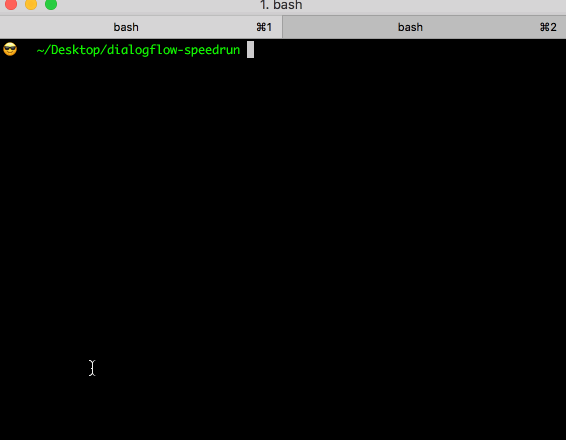
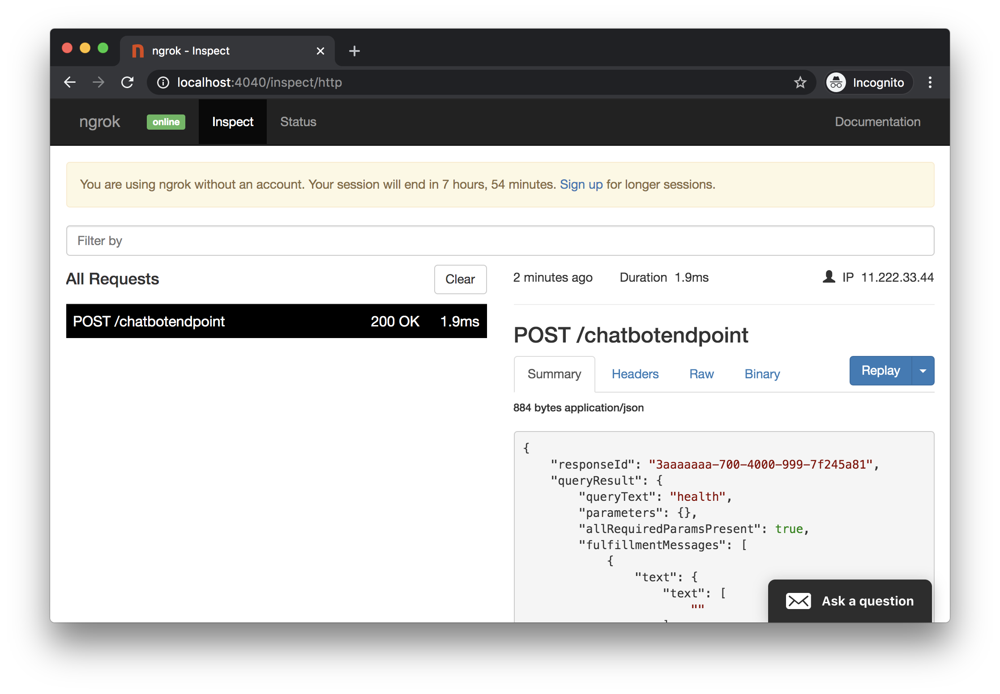

## Quickstart

Note: The steps below assume you have a functioning DialogFlow agent, **[nGrok](#nGrok)** is used for tunneling

## 1. Open a terminal & enter the following:

(This will setup the repo and start the server in reload mode)

```sh
git clone https://github.com/valgaze/dialogflow-speedrun
cd dialogflow-speedrun
npm i
npm run server:dev
```

## 2. Open another terminal & type the following

(This will open a tunnel using **[nGrok](#nGrok)**)

```sh
cd dialogflow-speedrun
npm run tunnel
```



## 3. Log in to DialogFlow

Copy & paste the URL from step 2 into the **fulfillment** section:


## 4. Create an intent called "health"

Add some training phrases (like _"health"_ or _"healthcheck"_) and click "Save" in the top right corner when you're done. (For this example make sure the intent's name spelled exactly _"health"_)


## 4a. Enable "fulfillment" too

Scroll to the very bottom to **Fulfillment**, expand the panel, tick the switch labeled _Enable webhook call for this intent_, then hit SAVE


## 5. Edit "webhook/index.js"

In **[webhook/index.js](./../webhook/index.js)** add the following line to activate our fulfillment handler & save changes:

```js
registerHandler(
  "health",
  require("./../examples/ex1_healthcheck/health.intent.js")
);
```

## 6. Take it for a spin

Give the webhook server a second to reload your changes, then go to the top right corner of DialogFlow to test your new "health check" intent and fulfillment code. (If you type something like _"health"_ or _"healthcheck"_ and see chocolate chip cookies it's working)


## 6a. (Extra Credit) Inspect Network Requests

Open **[http://localhost:4040](http://localhost:4040)** to use a traffic inspector from nGrok to see what DialogFlow sends to your webhook (you can also "replay" requests)



## 7. Do other stuff!

Now that you have a your webhook setup, you're ready to start writing fulfillment & complex conversations in DialogFlow.

- Look at other **[examples](./../examples/README.md)**

- Learn about **[DialogFlow Basics](./resources.md#Great-3rd-Party-Resources)** & **[Core Concepts](./glossary.md)**

### nGrok

nGrok will tunnel a port on your machine to a fixed URL controlled by nGrok's system. This is done as a convenience step to get up and running as quickly as possible.

<details><summary>(Expand for details on nGrok)</summary>
<p>

**IMPORTANT:** nGrok will expose your port to nGrok's systems so your local install can talk to DialogFlow-- there are password-protection & Pro/paid plans: https://ngrok.com/pricing

nGrok was developed by Alan Shreeve as a way to learn Go. nGrok will open a "secure" tunnel to nGrok's system so external services (like DialogFlow's webhook system) can access exposed resources on your local machine as if they were deployed on the public internet. This can make developing fulfillment webhooks insanely convenient & fast-- nGrok also comes with a network inspector available on localhost:4040

While it's really simple/fast to get up and running with a webhook, the downside of this approach is that every time you restart nGrok you will be assigned a new URL which you'll need to update inside DialogFlow's fulfillment settings (paid versions of nGrok have persistent URLs & other features.)

Additionally, this repo uses an **[npm package](https://www.npmjs.com/package/ngrok)** which instruments on top of nGrok and will append the endpoint specified in **[config.js](../config.js)**

Using nGrok means you...

- Trust nGrok & the team building systems/servicing for it

- Trust author of nGrok npm package (you can inspect this repo's **[package-lock.json](../package-lock.json)**) which downloads an nGrok binary

nGrok is used for convenience only (no deployment, live reload, etc), you can alternatively deploy as a publicly-accessible resource, ex like a **[Cloud Function](https://cloud.google.com/functions/docs/writing)**

</p>
</details>
