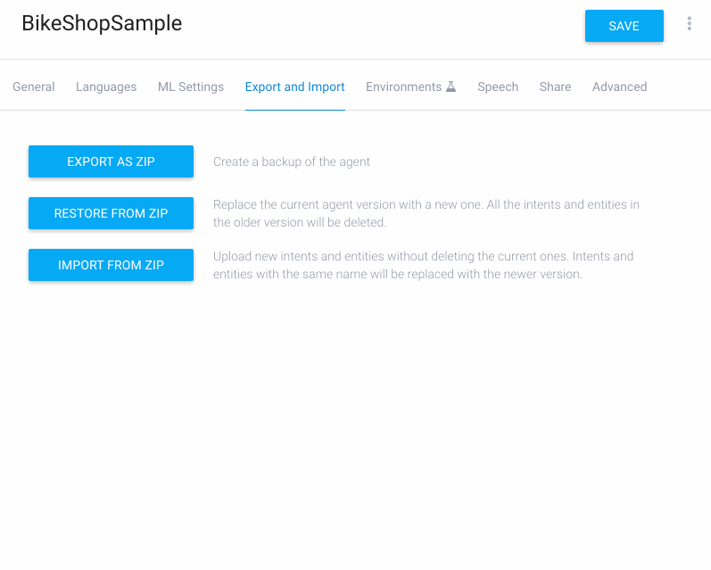

## Running the examples

To "run" the examples in this repo you'll need to have:

- An agent on DialogFlow (really means a Google Account)

- Access to a machine running **[NodeJS](https://nodejs.org/en/download/) v8+**

- This repo cloned on your machine and dependencies installed using the ```npm install``` command

See **[below for details on nGrok](#nGrok)** & **[advice for troubleshooting](#Troubleshooting)**


----

## Experimenting with an example

### 1) Saving/loading intents

Rather than recreating intents by hand, you can instead upload a config file to save time. Select/create your agent and then tap the settings icon next to your agent's name. Select the tab marked **Export and Import** and then tap the **"IMPORT FROM ZIP"** to import the *Archive.zip* file from the example's directory:



Any special intents/entity/context/etc configuration should now be available in the DialogFlow web console.

### 2) Register the fulfillment code

Each example will have a fulfillment "handler" file named **example_name.intent.js** that needs to be attached to an **intent** in **[webhook/index.js](./../webhook/index.js)** Anytime the intent is matched, the associated fulfillment handler will fire. An intent can only have a single handler (but that single handler can contain logic that alters behavior based on the parameters/context from the matched intent.)

You can copy/paste from the example's readme a line that will look something like this:

```js
registerHandler('intent name', require('./../examples/exname/ex_name.intent.js'));
```

### 3) "Turn on" the webhook

The easiest thing to do is open 2 terminal windows and change the directory to dialogflow-speedrun in both of them. 


A) In one window turn on the server by typing:

```sh
npm run server:dev
```

* Note that with the command above, if you change/save your code the webhook server will restart for you automatically

B) In the other terminal window, enter the following command to get the fulfillment webhook URL from **[nGrok](#nGrok)** (CTRL-C to quit)

```sh
npm run tunnel
```


[Optional] Get 2 copy/pastable commands:

If you have any trouble with above, run this command from whichever director you cloned this repo:

```
npm run 1st_time
```

### 4) Update the fulfillment webhook URL in DialogFlow

In DialogFlow, select **Fulfillment** from the left column and then update the fulfillment URL in DialogFlow-- scroll to the bottom and tap Save


### 5) Test in simulator

The top right corner of DialogFlow is a chat simulator where you can test drive your intent


### 6) [Optional] Network inspector

nGrok ships with a powerful network inspector, you can access it on **[http://localhost:4040](http://localhost:4040)** whenever the tunnel is active. You can **inspect all the traffic between DialogFlow and your webhook and even replay requests**


### nGrok

nGrok will tunnel a port on your machine to a fixed URL controlled by nGrok's system. This is done as a convenience step to get up and running as quickly as possible. 

<details><summary>(Expand for details on nGrok)</summary>
<p>
nGrok was developed by Alan Shreeve as a way to learn Go. What it does is open a secure tunnel to nGrok's system so external services (like DialogFlow's webhook system) can access resources on your local machine as if they were deployed on the public internet. This can make developing fulfillment webhooks insanely convenient when strating out.

While it's really simple/fast to get up and running with a webhook, the unfortunate part is that every time you shut down/restart nGrok you will need to update your Fulfillment URL in DialogFlow. A good rule of thumb: if nGrok isn't running, that also means your webhook isn't running.

This repo uses an **[npm package](https://www.npmjs.com/package/ngrok)** which instruments on top of nGrok and will append the endpoint specified in **[config.js](../config.js)**

nGrok also comes with a network inspector available on localhost:4040

If you suspect security when using nGrok is a non-trivial source of risk, please see https://ngrok.com/docs for more information

</p>
</details>


### Troubleshooting

- Try running the "health" command to sanity-check fulfillment and rule out a configuration issue

- Try running ```npm install``` from the root directory of dialogflow-speedrun

- Doublecheck nGrok is running

- Doublecheck server is running

- Doublecheck the intent has fulfillment enabled

- Doublecheck the fulfillment URL in DialogFlow matches the URL you see from ```npm run tunnel```


