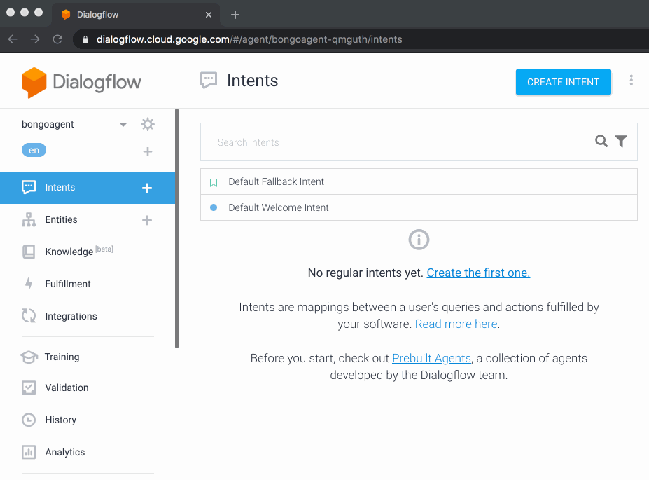
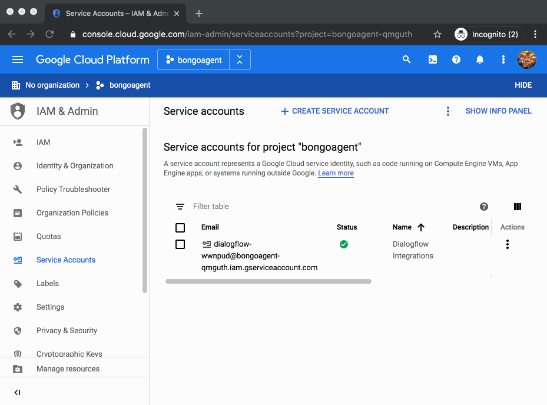

## Get a Service Account

In order to interact with DialogFlow APIs (like detecting an intent or fetching/creating contexts, etc) you will need an authentication mechanism.

Below is the fastest route to a credential file that has 3 properties of interest: ```client_email```, ```private_key```, & ```project_id```

## Step 1: Access Google Cloud's IAM services

1. Select your agent from dropdown in top left corner of DialogFlow's web console

2. Tap the settings gear icon which should take you to the **General** section of DialogFlow web console's config

3. Scroll down and tap the gray cell next to **Service Account** to open a new window to your project

Ex.



## Step 2: Create a service account & create a key

1. Tap "+ Create Service Account" & give it a name and description

2. In the "Select a Role" field, pick an appropriate role for your application/usage, for now we'll select the permissive, **DialogFlow API Admin** & tap continue (see **[below](#resources)** for information on which permission might best suit your needs)

3. After tapping continue, on the next page scroll down and tap the button "+Create Key"

4. Select JSON, download your credential, rename it to ```service-account.json``` and place inside your project




## Resources

|  **ITEM** | **URL** |
| :---: | :---: |
|  Auth Overview | https://dialogflow.com/docs/reference/v2-auth-setup |
|  Service Accounts | https://console.cloud.google.com/iam-admin/serviceaccounts |


Role types from the **[docs](https://dialogflow.com/docs/reference/v2-auth-setup)**:

|  **Role name** | **Access description** |
| :--- | :--- |
|  Dialogflow API Admin | Full API access |
|  Dialogflow API Client | Session level API access |
|  Dialogflow API Reader | Read-only API access |


