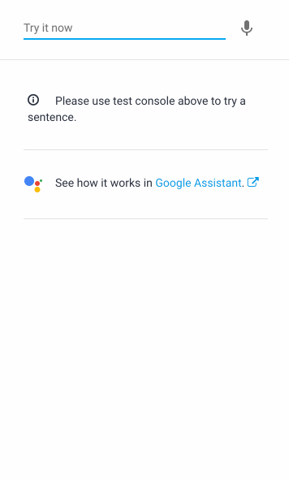

**[Jump to Demonstration >>](#DiagramScreenshots)**

## Setup

For details on how to run this and any other example, see the **["Running the Examples" Guide](./../../docs/running_the_examples.md)** in the **[docs](./../../docs/README.md)** directory

1) Import Agent.zip to load intents & other configuration to the DialogFlow web console

2) Add the following to **[webhook/index.js](./../../webhook/index.js)** (note the intent name "health"):


```js
registerHandler('health', require('./../examples/ex1_healthcheck/health.intent.js'));
```

## Description

Think of this as a mini welcome-to-DialogFlow example. We'll dive right in and immediately make an intent that uses **[DialogFlow's fulfillment feature.](https://cloud.google.com/dialogflow/docs/fulfillment-overview)** 

What we're building first is a handy "helper" intent that you can always use to make sure everything is working correctly with your webhook. If you type "health" and see chocolate chip cookies you'll know it's working.

What we'll do in this example is create an intent called **"health"** and seed with training/matching phrases like "health" or "healthcheck." This intent will use fulfillment to return to the user a card with the current time on the server.

You can make the health intent by hand or (much faster) by importing Archive.zip in this directory.

If you can type "health" and see a response in the DialogFlow simulator, that means you've got an intent powered by a webhook!

## Diagram/Screenshots

We're making this:

