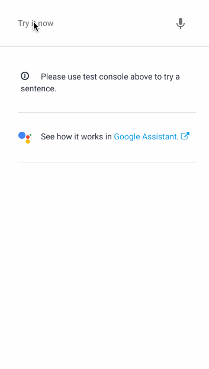

**[Jump to Demonstration >>](#Diagram/Screenshots)**

## Setup

For details on how to run this and any other example, see the **["Running the Examples" Guide](./../../docs/running_the_examples.md)** in the **[docs](./../../docs/README.md)** directory

1) Import Agent.zip to load intents & other configuration to the DialogFlow web console

2) Add the following to **[webhook/index.js](./../../webhook/index.js)** (note the intent name "kitchen"):


```js
registerHandler('kitchen', require('./../examples/ex2_kitchensink/kitchensink.intent.js'));
```

## Description

In this example we're going to build an intent that will return all the "rich" responses available from the **[dialogflow-fulfillment library](https://www.npmjs.com/package/dialogflow-fulfillment)** that will render in the DialogFlow simulator.

A rich response is any response that's not text that gets returned to the user (like a card, image, or "suggestion chip.") It is up to individual platforms to decide how to display and handle rich responses.

Note that DialogFlow integrates with a LOT of different platforms and each platform could handle rich responses differently. (Ex. for agents targeting Google Assistant, you'd use the **[actions-on-google](https://www.npmjs.com/package/actions-on-google)** alongside this dialogflow-fulfillment to render Google Assistant-only responses like carousels & lists.) For our purposes here, we only care about successfully working fulfillment and rendering something to the DialogFlow simulator, so the dialogflow-fulfillment library is all we need for now.

We'll return three items to our user:

- Card
- Image
- Suggestion "chip" (when you tap it it's like chatting)

## Diagram/Screenshots

We're making this:

