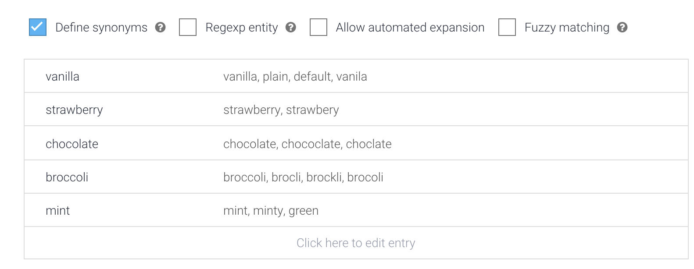
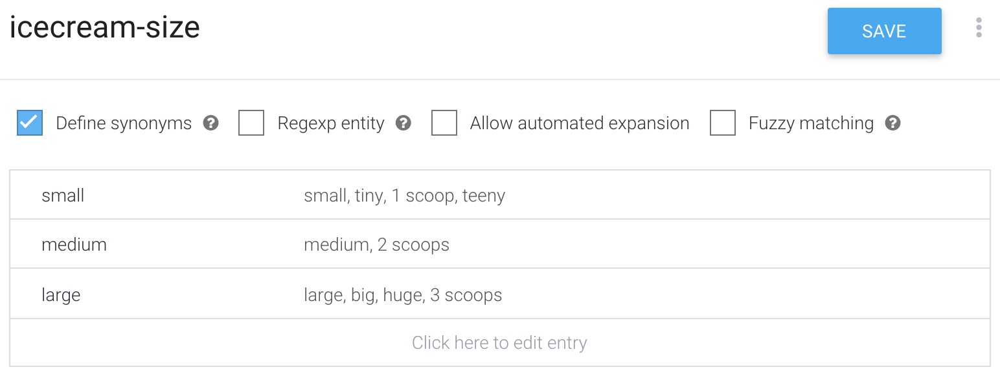
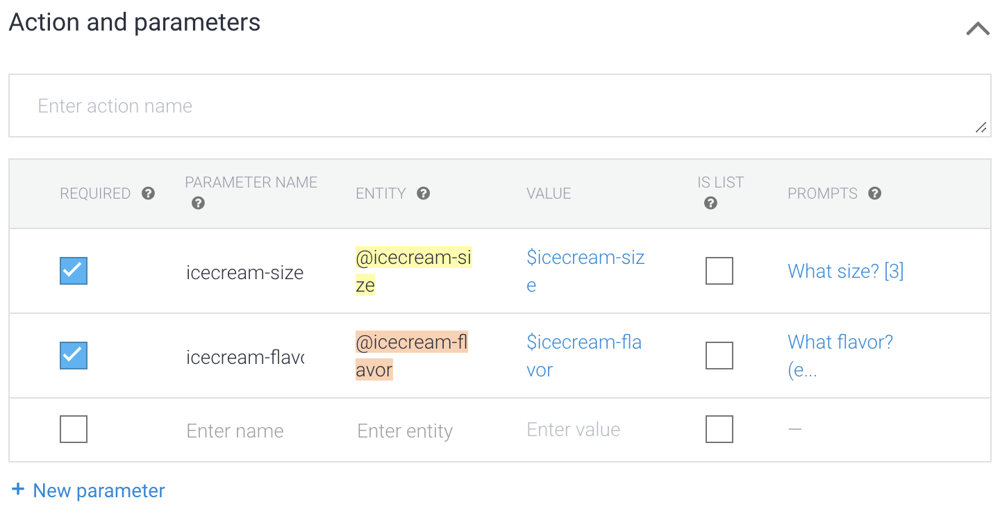
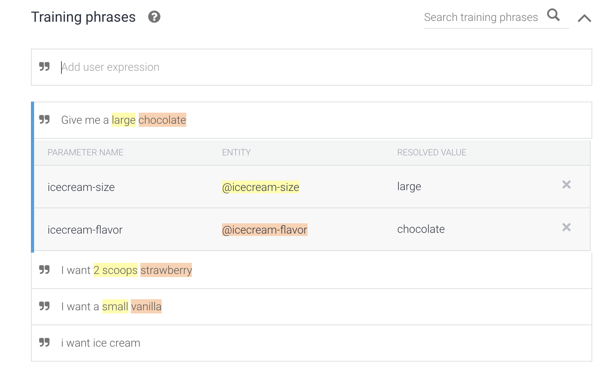
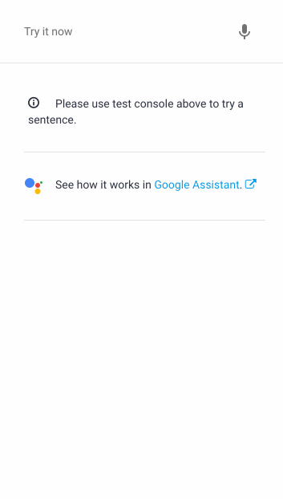

**[Jump to Demonstration >>](#Diagram/Screenshots)**

## Setup

For details on how to run this and any other example, see the **["Running the Examples" Guide](./../../docs/running_the_examples.md)** in the **[docs](./../../docs/README.md)** directory

1) Import Agent.zip to load intents & other configuration to the DialogFlow web console

2) Add the following to **[webhook/index.js](./../../webhook/index.js)** (note the intent name "order.icecream"):


```js
registerHandler('order.icecream', require('./../examples/ex3_icecream/icecream.intent.js'));
```

## Description

If you made it through the **["healthcheck"](./../ex1_healthcheck/README.md)** and **["kitchen sink"](./../ex2_kitchensink/README.md)** examples, you're equipped with all you need to start ordering icecream. This intent will let your users to order ice cream by specifying a size and flavor and return a rich response with a photo. This is our 1st somewhat "fancy" intent that uses fulfillment, entities, and parameters-- it's worth calling out a few items to notice in the DialogFlow web console:

### 1) Entities
Take a look at the **Entities** section on the left column. For this intent we're defining two custom entities, (1) **icecream flavor** and (2) **icecream size.** Note how we provide DialogFlow with valid broad categories and then with many "synonyms" to help it extract similiar information from new sentences.





Further reading: https://cloud.google.com/dialogflow/docs/entities-custom

### 2) Parameters
In the Actions and Parameters section of this intent, we "create" two parameters, icecream-size and icecream-flavor which are based on our icecream-size and icecream-flavor **entities.** These parameters are marked as **REQUIRED**, which means the intent will refuse to "take off" until those parameters are matched. DialogFlow will continue to ask the user (with questions you specify) until it obtains the required data from the user. The procedure of querying the user until they "fill" the empty/missing parameter is called **["Slot filling."](https://cloud.google.com/dialogflow/docs/intents-actions-parameters#required)**



### 3) Training phrases
In the Archive.zip included in this example, there are only a handful of training phrases-- definitely add more! You can help "teach" DialogFlow how to extract parameters from your users' text by adding tricky examples and **["annotating them.**](https://cloud.google.com/dialogflow/docs/intents-training-phrases#annotation)** As you add more tagged/annotated training samples to DialogFlow, your agent will get better at extracting those parameters. 




## Diagram/Screenshots

We're making this:



## Extra credit

- Add lots of training phrases to help DialogFlow recognize more sentences, be sure to **[annotate them](https://cloud.google.com/dialogflow/docs/intents-training-phrases#annotation)**

- Add a 3rd criteria about how you'll get your icecream home-- a cone, paper bowl, etc

- Add a feature where you could add unlimited "toppings" of anything at all

- What does the "automated expansion" toggle mean for entities?


