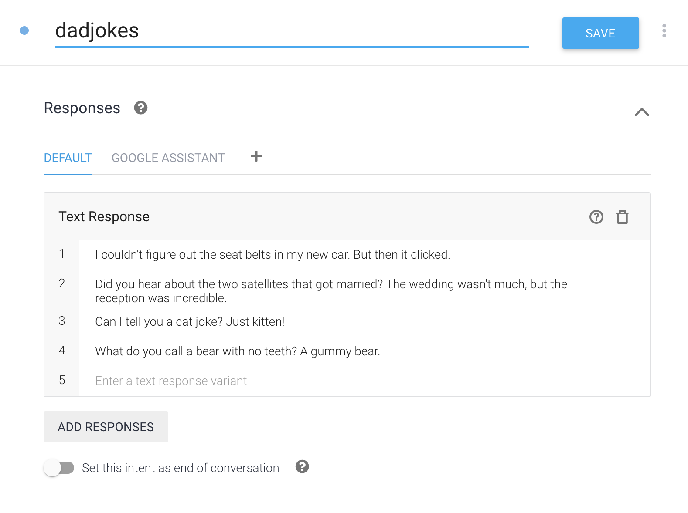
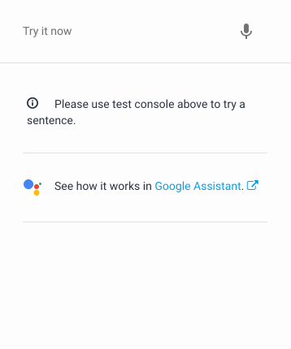
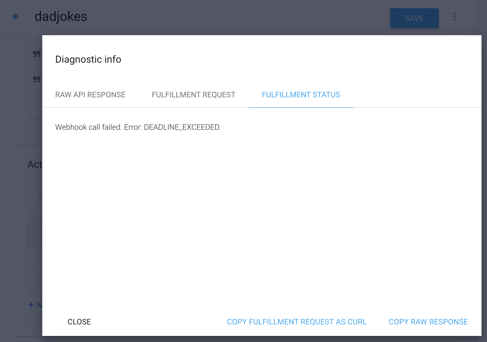
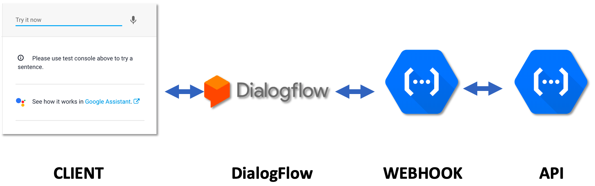

**[Jump to Demonstration >>](#DiagramScreenshots)**

## Setup

For details on how to run this and any other example, see the **["Running the Examples" Guide](./../../docs/running_the_examples.md)** in the **[docs](./../../docs/README.md)** directory

1) Import Agent.zip to load intents & other configuration to the DialogFlow web console

2) Add the following to **[webhook/index.js](./../../webhook/index.js)** (note the intent name "dadjokes"):


```js
registerHandler('dadjokes', require('./../examples/ex4_dadjokes/dadjokes.intent.js'));
```

## Description

If you made it through the **["healthcheck"](./../ex1_healthcheck/README.md)** and **["kitchen sink"](./../ex2_kitchensink/README.md)** & **["ice cream"](./../ex3_icecream/README.md)** examples, you're equipped with most of what you need to know to build rich conversational experiences.

In this example --**finally**-- we'll get to the core of what fulfillment is all about: integrating/connecting with other services. We'll do this in a profoundly obnoxious way: we're gonna tell some "**[dad jokes](https://en.wikipedia.org/wiki/Dad_joke)**"

The 3rd-party with which we'll integrate is the **[icanhazdadjoke.com](https://icanhazdadjoke.com/)** API service. We'll use the API to retrieve a random dad joke and return it to the user rendered in a card with a link to the API response.

Below is a random sample from the icanhazdadjoke API:

```json
{
    "id": "R7UfaahVfFd",
    "joke": "My dog used to chase people on a bike a lot. It got so bad I had to take his bike away.",
    "status": 200
}
```

### 1) Do we even need to use fulfillment for this?

There's nothing wrong with avoiding fulfillment & making a bunch of "static" responses like this:



The experience isn't exactly groundbreaking but this approach works:



If you want to do more-- ie have lots of dad jokes that you can update independently or add a custom prefix in front of the joke, present to the user in card with a random photo, etc-- you need a bit of fulfillment code.


### 2) A note on speed

Before adding an API integration, it's important to reality-check the performance and stability of any 3rd-party service with which you're integrating. 

According to **[DialogFlow Docs](https://dialogflow.com/docs/fulfillment/how-it-works
)** (**[& here](https://developers.google.com/actions/sdk/deploy-fulfillment)**), fulfillment must complete within a 5 second timelimit. This limit makes a lot of sense because a chat experience is only good/valuable if it's responsive. If the services with which you're integrating can't do their work within 5 seconds, it might not be a good fit for fulfillment at this time. Fulfillment should not be a computationally-intensive task, it should be quick.

The icanhazdadjoke.com API requires no authentication and is free to use-- we should, therefore, have basically ZERO expectations about its stability or performance. Believe it or not, occassionally icanhazdadjoke.com breaks our limit:




DialogFlow fulfillment, it must be remembered, does not communicate directly with the client. 

You can imagine the "pipeline" of a fulfillment request starting from the user entering natural language looks like this:

```
Client/User << >> DialogFlow << >> Webhook << >> API
```




Depending on your architecture, DialogFlow usually controls most of the communication with the client and accordingly sets the rules for fulfillment. Note that this limit may be relaxed or there may be a new feature in the future circumventing this limit (ie deferred fulfillment)-- however in the meantime, it's still a good idea to keep fulfillment short and quick.


## Diagram/Screenshots

We're making this:


## Extra credit

- Replace icanhazdadjoke with a faster service

- Build your own performant dadjoke API service

- Ask for a type of Dad joke by using the **[icnahazdadjoke search API](https://icanhazdadjoke.com/api#search-for-dad-jokes)** (see the **[ice cream example](./../ex3_icecream/README.md)** & **[here](https://cloud.google.com/dialogflow/docs/training#add_and_edit_entity_annotations_for_the_request)** for how to capture the topic)

- If you get no results for a topic, gracefully tell the user no jokes and provide a backup joke within fulfillment's 5 second resolution time

- Add lots of training phrases to help DialogFlow recognize more sentences, be sure to **[annotate them](https://cloud.google.com/dialogflow/docs/intents-training-phrases#annotation)**


